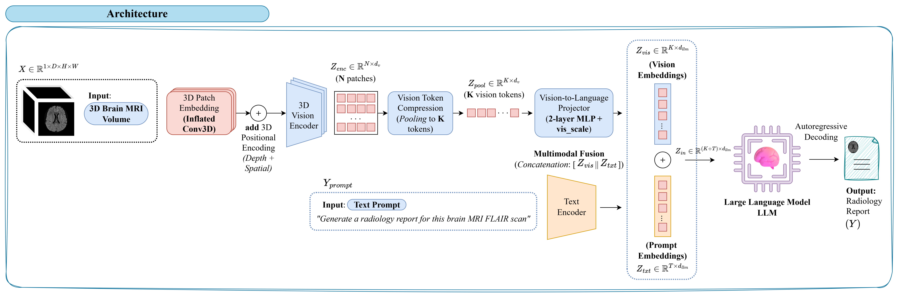
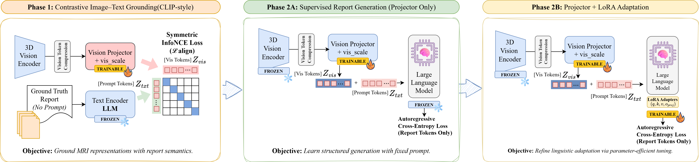
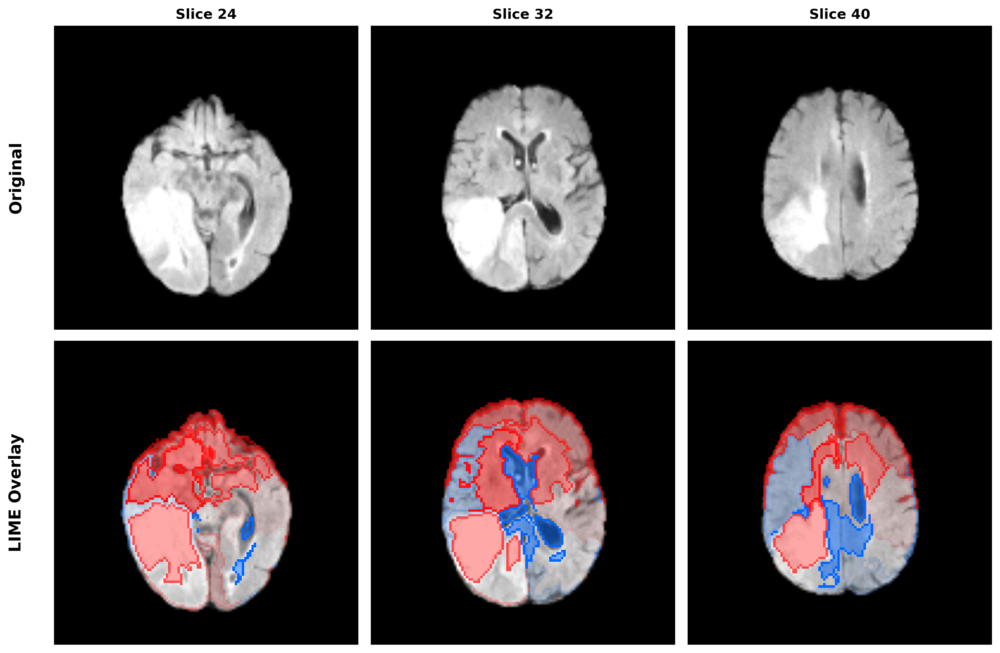

# 🧠 BrainGemma3D

<div align="center">
    <a href="https://huggingface.co/praiselab-picuslab/BrainGemma3D" target="_blank"></a>
    <a href="https://huggingface.co/spaces/giuseppericcio/BrainGemma3D" target="_blank"></a>
    <a href="https://www.kaggle.com/code/antonioromano45/braingemma3d" target="_blank"></a>
    <a href="https://www.kaggle.com/competitions/med-gemma-impact-challenge/overview" target="_blank"></a>
</div>

<div align="center">
    <h3>Brain Report Automation via Inflated Vision Transformers in 3D</h3>
    <p><i>Bridging the gap between 2D medical foundation models and 3D neuroradiology</i></p>
</div>

<hr>

## 📋 Overview

**Official Submission to the [MedGemma Impact Challenge](https://www.kaggle.com/competitions/med-gemma-impact-challenge/overview)**

**BrainGemma3D** is a staged vision-language framework that generates clinically accurate radiology reports directly from **native 3D brain MRI** volumes. Current medical vision-language models (VLMs) process volumetric scans using 2D slice-based approximations, fragmenting the spatial context critical for accurate neuroradiological interpretation. Our approach inflates a pretrained 2D medical encoder ([**MedSigLIP**](https://huggingface.co/google/medsiglip-448)) into a native 3D architecture and progressively aligns it with a causal language model ([**MedGemma-1.5-4B-IT**](https://huggingface.co/google/medgemma-1.5-4b-it)) through three training stages:

1. **Contrastive Grounding**: Establishes visual-textual correspondence in a shared latent space
2. **Projector Warmup**: Stabilizes multimodal conditioning with supervised learning
3. **LoRA Linguistic Specialization**: Adapts the LM to generate structured clinical reports instead of verbose captions

Unlike generalist 3D medical VLMs, **BrainGemma3D** is tailored to neuroradiology, where hemispheric laterality, tumor infiltration patterns, and anatomical localization are diagnostically critical.

---

## ❌ The Clinical Problem

Brain MRI interpretation is **intrinsically volumetric**. Neuro-oncologists assess tumor infiltration, edema extent, and mass effects across three spatial dimensions. However, current medical VLMs process MRI volumes as independent 2D slices, leading to:

- **Broken spatial continuity** → Loss of 3D context needed for tumor segmentation
- **Laterality inversion** → Confusion between left/right hemispheres (critical for treatment planning)
- **Hallucinated lesions** → False positives due to lack of volumetric coherence
- **Radiologist burnout** → Up to 60% of time spent dictating reports manually

---

## 🏗️ Architecture

**BrainGemma3D** builds upon Google's **Health AI Developer Foundations (HAI-DEF)**, upgrading the 2D vision encoder to native 3D processing while keeping the language model frozen.

<div align="center">
    
    <p><i>Figure 1: Architecture Overview. MedSigLIP is inflated from 2D to 3D via center-frame weight initialization. Volumetric tokens are compressed (32 tokens) and projected into the frozen MedGemma LLM.</i></p>
</div>

### Key Components

| Component | Description | Parameters |
|-----------|-------------|------------|
| **3D Vision Encoder** | MedSigLIP inflated to 3D (Conv2D → Conv3D) | 450M (frozen after Phase 1) |
| **Token Compressor** | Reduces 3D patches to 32 visual tokens | 2 Perceiver layers |
| **Vision-Language Projector** | Projects visual tokens to LM embedding space | 2-layer MLP |
| **Language Model** | MedGemma-1.5-4B-IT (4-bit quantized) | 4B (frozen, LoRA in Phase 3) |

---

## 🎓 Staged Training Pipeline

To prevent catastrophic forgetting and ensure clinical accuracy, we train the model in **three progressive stages**:

<div align="center">
    
    <p><i>Figure 2: Three-Stage Training. (1) Contrastive grounding aligns 3D vision and text. (2) Projector warmup trains the projection layer. (3) LoRA adaptation fine-tunes the LM for report generation.</i></p>
</div>

### Phase 1: Contrastive Alignment (Image-Text Grounding)
- **Goal**: Align 3D visual features with textual report embeddings
- **Loss**: InfoNCE (CLIP-style contrastive learning)
- **Trainable**: 3D Vision Encoder + Projector
- **Frozen**: Language Model

### Phase 2A: Projector Warmup (Supervised Fine-Tuning)
- **Goal**: Train the projector to condition the LM effectively
- **Loss**: Next-token prediction (Cross-Entropy)
- **Trainable**: Projector only
- **Frozen**: Vision Encoder + Language Model

### Phase 2B: LoRA Linguistic Specialization
- **Goal**: Adapt LM to generate structured clinical reports (not captions)
- **Loss**: Next-token prediction (Cross-Entropy)
- **Trainable**: Projector + LoRA adapters (rank=4) on LM attention layers
- **Frozen**: Vision Encoder + LM base weights

---

## ⭐ Performance

Evaluated on 20% of 369 BraTS pathological cases + 99 healthy controls with stratified group-based splits to prevent data leakage.

### Quantitative Results

| Model | BLEU-1 | BLEU-4 | ROUGE-L | CIDEr | Lat F1 | Anat F1 | **Path F1** |
|-------|--------|--------|---------|-------|--------|---------|-------------|
| **Med3DVLM** *(3D Generalist)* | 0.051 | 0.005 | 0.083 | 0.007 | 0.300 | 0.225 | 0.119 |
| **MedGemma 1.5** *(2D Slice)* | 0.245 | 0.024 | 0.189 | 0.029 | 0.526 | 0.461 | 0.413 |
| **BrainGemma3D** *(Ours)* | **0.302** | **0.098** | **0.289** | **0.293** | **0.689** | **0.691** | **0.951** |

> **Key Insight**: The **+130% gain in Pathology F1** (0.951 vs 0.413) demonstrates that native 3D processing is essential for diagnostic accuracy in neuroradiology.

### Clinical Metrics

- **Laterality F1**: 0.689 (correct hemispheric localization)
- **Anatomy F1**: 0.691 (accurate anatomical structure identification)
- **Pathology F1**: 0.951 (near-perfect pathological entity recognition)
- **Healthy Specificity**: 1.0 (zero hallucinations on healthy controls)

---

## 🔍 Interpretability

We use **3D LIME** (Local Interpretable Model-agnostic Explanations) to visualize which brain regions drive the model's diagnostic predictions.

<div align="center">
    
    <p><i>Figure 3: LIME attribution maps for BraTS training sample 072. Red regions show supervoxels that positively contribute to pathology predictions. The model correctly focuses on tumor-affected areas in the left parietal and frontal lobes.</i></p>
</div>

### Example: 

**Ground Truth Report:**  
The lesion area is in the **frontal and parietal regions of the left hemisphere** with mixed signal intensities of varying levels and speckled high-intensity signal areas. **Edema** is primarily concentrated in the peripheral regions of the left frontal and parietal lobes, indicating moderate to severe swelling of the tissues surrounding the lesions. **Necrosis** is observed in some lesion areas displaying low signal intensity interspersed within regions of high and isointense signals, showing a certain mottled appearance. **Ventricular compression** is mild deformation of the ventricles, suggesting pressure effects of the lesions on these regions.

**BrainGemma3D Generated Report:**  
The lesion area is in the **left parietal and frontal lobes** with mixed high-signal areas. **Edema signals are mainly observed** around these lesions, indicating significant edema presence affecting parts of both frontal and temporal regions as well as some portions within the parietal lobe. **Necrosis may be present** at low signal intensity or scattered throughout certain sections of the brain tissue affected by edema but shows no clear concentration. **Ventricular compression effects** on adjacent ventricles can occur due to pressure from surrounding tissues near the ventricular system.

> ✅ **Clinical Accuracy**: The model correctly identifies laterality (left hemisphere), anatomical locations (parietal and frontal lobes), and key pathological features (edema, necrosis, ventricular compression). LIME attribution maps confirm the model's attention is focused on the actual tumor regions.

---

## 📁 Project Structure

```
BrainGemma3D/
├── braingemma3d_architecture.py        # Model architecture (3D encoder + projector + LM)
├── braingemma3d_training.py            # Three-stage training pipeline
├── braingemma3d_inference.py           # Inference script for report generation
├── braingemma3d_evaluation.py          # Scientific evaluation (BLEU/ROUGE/Clinical F1)
├── braingemma3d_evaluation_ablation.py # Ablation study evaluation
├── interpretability.py               # LIME-based 3D interpretability
├── preprocess_healthy_brains.py      # Preprocessing for healthy controls
├── Baseline/
│   ├── medgemma_baseline.py          # 2D MedGemma baseline
│   ├── evaluate_medgemma.py          # Evaluation script for 2D baseline
│   ├── md3vlm_baseline.py            # Med3DVLM baseline implementation
│   ├── evaluate_md3vlm.py            # Evaluation script for 3D baseline
│   └── m3d_baseline.py               # M3D architecture wrapper
└── imgs/
    ├── BrainGemma3D-Arch.png           # Architecture diagram
    ├── BrainGemma3D-Arch2.png          # Training pipeline diagram
    └── BrainGemma3D-Interpretability.png # LIME visualization
```

### File Descriptions

| File | Purpose |
|------|---------|
| `braingemma3d_architecture.py` | Defines the BrainGemma3D model: 3D vision encoder (inflated SigLIP), token compressor, projector, and quantized MedGemma LM. Includes NIfTI loading utilities. |
| `braingemma3d_training.py` | Complete three-stage training pipeline: contrastive grounding → projector warmup → LoRA adaptation. Handles balanced datasets (BraTS + healthy controls) with group-based splits. |
| `braingemma3d_inference.py` | Generate radiology reports from trained checkpoints. Supports single-volume, batch, and quick-test modes. |
| `braingemma3d_evaluation.py` | Compute NLG metrics (BLEU/ROUGE/METEOR/CIDEr/BERTScore) and clinical F1 scores (Laterality/Anatomy/Pathology) on the test set. |
| `braingemma3d_evaluation_ablation.py` | Evaluate checkpoints from each training stage to measure the contribution of contrastive grounding, projector warmup, and LoRA. |
| `interpretability.py` | Generate LIME attribution maps for 3D MRI volumes. Visualizes supervoxels that drive model predictions. |
| `preprocess_healthy_brains.py` | Preprocess healthy brain MRI scans: skull stripping (ANTsPy), reorientation, normalization, and resizing to (64,128,128). |
| `Baseline/` | Baseline implementations for comparison: 2D slice-based MedGemma and Med3DVLM (3D generalist). |

---

## 🚀 Quick Start (Training and Inference)

### 1. Installation

```bash
# Clone repository
git clone https://github.com/PRAISELab-PicusLab/BrainGemma3D.git
cd BrainGemma3D

# Install dependencies
pip install -r requirements.txt
```

### 2. Download Pretrained Models

```bash
# Download MedSigLIP and MedGemma from Hugging Face
huggingface-cli login
huggingface-cli download google/medsiglip-448 --local-dir Models/siglip
huggingface-cli download google/medgemma-1.5-4b-it --local-dir Models/medgemma
```

### 3. Training (Three Stages)

```bash
# Stage 1: Contrastive Grounding
python braingemma3d_training.py \
    --base-dir /path/to/data \
    --run-phase1 \
    --phase1-epochs 10 \
    --output-dir checkpoints/exp1

# Stage 2A: Projector Warmup
python braingemma3d_training.py \
    --base-dir /path/to/data \
    --load-from checkpoints/exp1/phase1_alignment \
    --run-phase2A \
    --phase2A-epochs 5

# Stage 2B: LoRA Adaptation
python braingemma3d_training.py \
    --base-dir /path/to/data \
    --load-from checkpoints/exp1/phase2a_warmup \
    --run-phase2B \
    --phase2B-epochs 5
```

### 4. Inference

```bash
# Generate report for a single MRI volume
python braingemma3d_inference.py \
    --checkpoint-dir checkpoints/exp1/phase2b_final \
    --input-volume path/to/brain_flair.nii.gz \
    --output-dir inference_output

# Quick test on random patient
python braingemma3d_inference.py \
    --checkpoint-dir checkpoints/exp1/phase2b_final \
    --quick
```

### 5. Evaluation

```bash
# Compute metrics on test set
python braingemma3d_evaluation.py \
    --checkpoint-dir checkpoints/exp1/phase2b_final \
    --num-brats-patients 369 \
    --seed 42 \
    --output-dir evaluation_results
```

### 6. Interpretability

```bash
# Generate LIME attribution maps
python interpretability.py \
    --checkpoint-dir checkpoints/exp1/phase2b_final \
    --input-volume path/to/brain_flair.nii.gz \
    --output-dir interpretability_output \
    --n-supervoxels 20
```

## 🚀 Quick start (Hugging Face)

### Requirements

```bash
pip install torch torchvision transformers nibabel scikit-image lime
```

### Model Download

```python
from huggingface_hub import snapshot_download

# 1. Download the repository containing our custom architecture from Hugging Face
repo_id = "praiselab-picuslab/BrainGemma3D"
print(f"Downloading repository: {repo_id}...")
local_dir = snapshot_download(repo_id)
print(f"✅ Repository downloaded to: {local_dir}")
```

### Usage

> **Note**  
> If you want to use **BrainGemma3D** but you do not have a 3D NIfTI image available for testing, you can use the sample image that we provide in this repository.  
>  
> The example file (example_file.nii) is intended for quick validation and to help you verify that the pipeline is working correctly before using your own data.

```python
import os
import torch
import sys
sys.path.append(local_dir)

from medgemma3d_architecture import MedGemma3D, load_nifti_volume, CANONICAL_PROMPT

# Automatically select the optimal hardware accelerator (GPU if available, otherwise CPU)
device = "cuda" if torch.cuda.is_available() else "cpu"
print(f"Hardware accelerator selected: {device}")

# 2. Instantiate the base architecture (3D-inflated MedSigLIP + MedGemma)
model = MedGemma3D(
    vision_model_dir=f"{local_dir}/vision_model",
    language_model_dir=f"{local_dir}/language_model",
    depth=2,
    num_vision_tokens=32,
    freeze_vision=True,
    freeze_language=True,
    device_map={"": 0} if device == "cuda" else None,
)

# 3. Load projector
proj_path = os.path.join(local_dir, "projector_vis_scale.pt")
print(f"Loading custom projector weights from: {proj_path}...")

# Load the checkpoint into memory
ckpt = torch.load(proj_path, map_location=device)

# Inject the weights into the visual projector (which bridges Vision and Language)
model.vision_projector.load_state_dict(ckpt["vision_projector"])

# Load the visual scaling factor, ensuring correct tensor formatting
if ckpt.get("vis_scale") is not None:
    if isinstance(ckpt["vis_scale"], torch.Tensor):
        model.vis_scale.data = ckpt["vis_scale"].to(device)
    else:
        model.vis_scale.data.fill_(ckpt["vis_scale"])

# Transition the model to evaluation mode for inference
model.eval()
print("✅ BrainGemma3D is fully loaded and ready for inference!")

# 4. Load MRI scan
volume = load_nifti_volume(
    "path/to/brain_flair.nii.gz",
    target_size=(32, 128, 128)
).to(device)

if volume.ndim == 4:
    volume = volume.unsqueeze(0)

# 5. Generate report
with torch.no_grad():
    report = model.generate_report(
        volume,
        prompt=CANONICAL_PROMPT,
        max_new_tokens=256,
        temperature=0.1,
        top_p=0.9,
    )

print("\n===== GENERATED REPORT =====\n")
print(report)
```

---

## 📊 Dataset

- **[BraTS 2020](https://www.kaggle.com/datasets/awsaf49/brats20-dataset-training-validation)**: 369 brain tumor MRI cases with clinical annotations from [TextBraTS 2021](https://github.com/Jupitern52/TextBraTS)
- **Healthy Controls**: 99 preprocessed healthy brain scans (skull-stripped, normalized) from [MPI-Leipzig Mind-Brain-Body](https://openneuro.org/datasets/ds000221/versions/00002)

### Preprocessing

1. **As-Closest-Canonical Orientation**: Align all volumes to RAS orientation
2. **Axis Transposition**: Convert (H,W,D) → (D,H,W) for volumetric processing
3. **Robust Normalization**: Percentile-based clipping (p1, p99) followed by min-max scaling
4. **Trilinear Resizing**: Downsample to (64, 128, 128) for memory efficiency

---

## 🤝 Contributing

We welcome contributions to improve the dataset! To contribute, simply open a pull request or report issues on our [issue tracker](https://github.com/PRAISELab-PicusLab/BrainGemma3D/issues). We look forward to your improvements!

---

## 🌐 Notes

- **Privacy-Preserving**: Designed for on-premise deployment in hospital IT infrastructure
- **Clinical Validation**: Evaluated on real clinical datasets with radiologist-written ground truth reports
- **Interpretability**: LIME attribution maps provide transparency for clinical decision support
- **Not for Clinical Use**: This is a research prototype. Do not use for actual medical diagnosis without proper validation and regulatory approval.

---

## 👨‍💻 Team

This project was developed by:

**Mariano Barone** · **Francesco Di Serio** · **Giuseppe Riccio** · **Antonio Romano** · **Vincenzo Moscato**

*Department of Electrical Engineering and Information Technology*  
*University of Naples Federico II, Italy*

---

<div align="center">
    <p><i>Built with ❤️ for the MedGemma Impact Challenge 🏆</i></p>
    <p><i>Advancing Medical AI with Google's Health AI Developer Foundations</i></p>
</div>
